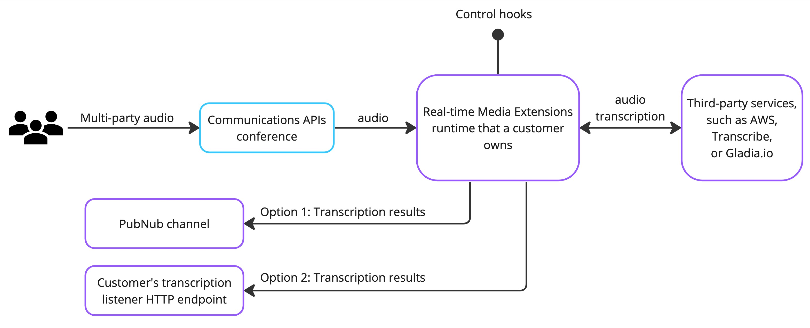

# Dolby.io Real-time Media Extensions
Real-time Media Extensions (RTME) is a dynamic, open-source utility for enhancing live media interactions. It provides a complete solution for automated, real-time media processing in the Dolby.io infrastructure. Each component provides its own API, but the project as a whole provides the ready-to-use application as well. With RTME, users can easily deploy its pre-built container image, providing immediate access to features like live transcription that boost user engagement and accessibility. 

In the future, we plan to extend RTME capabilities with on-premises recording, real-time media analysis, server-side media injection, and interactive AI chatbots. Our vision is for RTME to remain a flexible, evolving solution for comprehensive live media enhancements, without forcing customers into specific third-party solutions. 

## Supported applications
### Live Transcription
- [AWS Transcribe](https://aws.amazon.com/transcribe/)
- [Gladia.io](https://www.gladia.io/)

## Supported platforms
The project is compatible with Ubuntu 20.04 or later.
